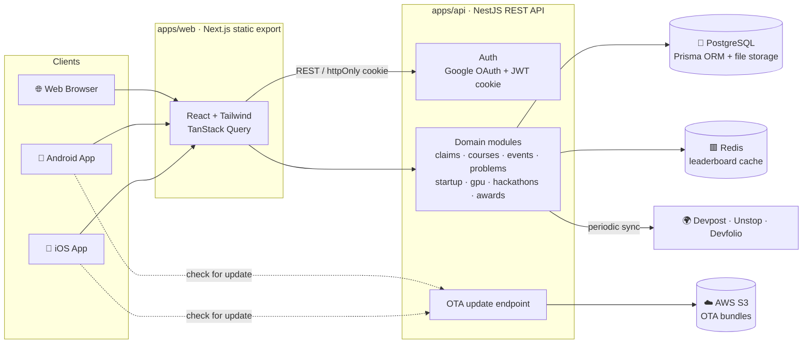

<div align="center">


# 🎓 AI Digital Passport

### NVIDIA AI Supercomputing & Competency Centre · Sri Eshwar College of Engineering

A gamified competency passport that tracks every student's AI journey, from their first Tech Eve to industry-grade projects, research papers and startups.
Students earn verified points, level up, unlock GPU credits and compete on a live leaderboard. Faculty mentor and verify, and admins run the whole centre from one console.

<br/>


<sub>🌐 Web &nbsp;·&nbsp; 🤖 Android &nbsp;·&nbsp; 🍎 iOS: one codebase, three platforms</sub>

</div>

---

## 📑 Table of Contents

- [✨ Highlights](#-highlights)
- [🧰 Tech Stack](#-tech-stack)
- [👥 Roles & Portals](#-roles--portals)
- [🚀 Features](#-features)
- [🏆 Gamification: Levels & Scoring](#-gamification-levels--scoring)
- [🏗️ Architecture](#️-architecture)
- [📁 Project Structure](#-project-structure)
- [🗄️ Data Model](#️-data-model)
- [⚡ Getting Started](#-getting-started)
- [🔑 Demo Accounts](#-demo-accounts)
- [📜 Scripts](#-scripts)
- [📱 Mobile (Capacitor)](#-mobile-capacitor)
- [🔄 Over-the-Air Updates](#-over-the-air-updates)
- [🔐 Security](#-security)
- [👨‍💻 Developed By](#-developed-by)

---

## ✨ Highlights

<table>
<tr>
<td width="33%" valign="top">

### 📲 Live QR Attendance
Rotating **TOTP-signed QR codes** refresh every 30 seconds, so a screenshot can't be shared with an absent friend. Check-in awards points instantly and can't be duplicated.

</td>
<td width="33%" valign="top">

### 🧑‍🏫 Mentor-Verified Points
Every certificate, GitHub project, DOI paper and hackathon win is **reviewed by faculty** before it counts, with a full append-only points ledger.

</td>
<td width="33%" valign="top">

### 🖥️ GPU Credit Economy
Students request **NVIDIA DGX GPU time**, mentors recommend and admins allocate. Industry partners can request compute too.

</td>
</tr>
<tr>
<td valign="top">

### 🛡️ Proctored Assessments
Live proctored course tasks detect **fullscreen exit, tab switch and window blur**. The fourth violation locks the session until a mentor grants access.

</td>
<td valign="top">

### 🏭 Industry Problem Bank
Real problems from partner organisations, solved through a **6-stage faculty-gated pipeline** from analysis to final delivery.

</td>
<td valign="top">

### 🚀 Startup Launchpad
Take an AI idea from pitch to **prototype, GPU validation, MVP, industry pilot and funding**, with a mentor review at every stage.

</td>
</tr>
</table>

---

## 🧰 Tech Stack

<div align="center">


</div>

<br/>

| Layer | Technologies |
| --- | --- |
| **Frontend** | -000?logo=nextdotjs&logoColor=white)      |
| **Mobile** |      |
| **Backend** |        |
| **Data** |   -DC382D?logo=redis&logoColor=white) -569A31?logo=amazons3&logoColor=white) |
| **Auth & Security** |    -555) |
| **Tooling** |        |

**Other libraries:** `jsqr` + `qrcode` (web QR scan/render) · `xlsx` (Excel import/export) · `react-select` · `@aws-sdk/client-s3` · `ioredis` · `cookie-parser`

---

## 👥 Roles & Portals

| | Role | Portal | What they do |
| :-: | --- | --- | --- |
| 🎓 | **Student** | Light "passport" app shell | Attend classes, take courses, submit claims, solve industry problems, build startups, request GPU time, climb the leaderboard |
| 🧑‍🏫 | **Mentor (Faculty)** | Dark operations console | Verify claims and course submissions, review problem/startup stages, run CoE classes, log teaching, unlock proctoring, track students |
| 🛠️ | **Admin** | Dark operations console | Manage users and whitelist, courses, classes, problems, scoring, GPU allocation, industry requests, awards, reports and audits |
| ⚖️ | **Evaluator / Jury** | Evaluator panel | Score hackathon submissions (innovation, technical, impact, presentation, completeness) |
| 🏢 | **Industry Partner** | *(data model ready)* | Company profile linked to problems and GPU requests |

---

## 🚀 Features

<details open>
<summary><b>🎓 Student Portal</b></summary>
<br/>

| Module | Features |
| --- | --- |
| 🏠 **Dashboard** | Nine-grid activity hub, points and level progress ring, next-level target, rank, recent activity and charts |
| 🏫 **CoE Classes** | Year-scoped class schedule (only your year's classes appear), live-now badges, upcoming and past sessions |
| 📷 **QR Scan** | Native ML Kit scanner on Android/iOS, `getUserMedia` + jsQR in the browser, and manual code entry everywhere |
| 📚 **Courses** | Catalog from NVIDIA DLI, Coursera, NPTEL and Udemy with difficulty, skills, outcomes and prerequisites; enrol, complete tasks, upload proof and get mentor approval for points |
| 🛡️ **Proctored Tasks** | Fullscreen live assessments with violation tracking; the session locks after 4 violations |
| 📝 **Claims** | Submit achievements with a PDF, GitHub link or DOI; track pending, approved and rejected status with mentor feedback |
| 🏭 **Industry Problems** | Browse problems from partner organisations and solve them through 6 gated stages: Analysis → Approach → Prototype → Testing → Demo → Delivery |
| 🚀 **Startup Launchpad** | 6-stage venture pipeline with stage-specific forms (pitch, prototype, GPU validation, MVP, pilot, funding) |
| 🖥️ **GPU Labs & Requests** | Request DGX GPU credits with a justification, and follow the flow draft → mentor-recommended → approved → allocated → completed |
| 🏆 **Hackathons** | Live feed of **Devpost, Unstop and Devfolio** hackathons (auto-synced), team registration, participation or winner proof, and in-house hackathons with teams and submissions |
| 📖 **Research & Certifications** | Record papers, patents and certifications |
| 🥇 **Leaderboard** | Redis-backed live ranking with cohort KPIs, falling back to PostgreSQL |
| 🎖️ **Awards** | Request or nominate for annual awards (AI Student of the Year, Best AI Startup, …) |
| 🔔 **Notifications & Profile** | Approval and rejection alerts, level-ups, digital passport profile |

</details>

<details>
<summary><b>🧑‍🏫 Mentor (Faculty) Portal</b></summary>
<br/>

- **Verification Queue**: shared-pool, paginated and filterable review of claims with an evidence viewer
- **Course Reviews**: approve or reject submissions, full CRUD on the course catalog, and **grant access** to locked proctoring sessions
- **CoE Classes**: create classes, activate the live rotating QR, co-teach with other faculty, and keep **teaching logs** (topics covered, materials, notes)
- **Industry Problems & Startups**: review stage submissions; approval unlocks the next stage
- **Hackathons**: verify registration and result proofs
- **Students**: per-student progress drill-down with the points timeline, claims, courses and projects
- **Awards & Leaderboard**: nominate students and view rankings
- **Department routing**: each mentor can own a department's notifications

</details>

<details>
<summary><b>🛠️ Admin Console</b></summary>
<br/>

| Area | Capabilities |
| --- | --- |
| 📊 **Dashboard & Reports** | Centre-wide KPIs, charts of points awarded over time, CSV/Excel export |
| 👤 **User Management** | Email access whitelist (manual or bulk Excel import), role assignment, points and GPU-credit corrections, high-impact flag |
| 🎓 **Students** | Cohort-wide progress by department, year and level, with drill-down |
| 🏫 **Events & CoE Classes** | Schedule classes by year, department and session, run live QR sessions, view attendance |
| 📘 **Faculty Teaching Logs** | Read every teaching log across departments and mentors |
| 📚 **Courses** | Full catalog management with tasks (standard / live-proctored) |
| 🏭 **Problem Bank** | Create, publish and archive problems with attached PDF, Excel or Word briefs; track every solution project |
| 🖥️ **GPU Allocation** | Approve and allocate student GPU requests |
| 🏢 **Industry GPU Requests** | Track company compute requests: New → Under Review → Approved → Fulfilled |
| 🚀 **Startups · Hackathons · Research** | Oversight of every venture, hackathon and publication |
| ⚙️ **Scoring & Levels** | Configure the points matrix and level thresholds (stored as data, not hard-coded) |
| 🏅 **Awards & Annual Audit** | Run the annual fellowship audit, rank candidates, confirm nominations |
| 🧾 **Audit Log** | Append-only trail of every sensitive action (logins, corrections, locks and unlocks, OTA publishes) |

</details>

---

## 🏆 Gamification: Levels & Scoring

<table>
<tr>
<td valign="top" width="50%">

#### 📈 Levels

| # | Level | Min Points | Unlocks |
| :-: | --- | --: | --- |
| 1 | 🌱 AI Explorer | 500 | Basic Centre Access |
| 2 | 🔧 AI Practitioner | 1,500 | Advanced Labs Access |
| 3 | 🏗️ AI Builder | 3,000 | GPU Project Credits |
| 4 | 💡 AI Innovator | 5,000 | Innovation Opportunities |
| 5 | 🔬 AI Researcher | 7,500 | Research GPU Cluster |
| 6 | 🏆 AI Champion | 10,000 + High Impact | Fellowship & Industry Perks |

</td>
<td valign="top" width="50%">

#### 🎯 Scoring Matrix

| Activity | Points |
| --- | --: |
| Tech Eve / Masterclass attendance | +10 |
| External hackathon registration | +20 |
| GPU Hands-on Friday Lab | +30 |
| NPTEL / Coursera course completion | +50 |
| Certification / Mini Project / Hackathon | +100 |
| Industry Project / Hackathon Win | +250 |
| Research Paper / Patent Filing | +300 |
| Assigned courses | per course |

</td>
</tr>
</table>

> Every point comes from an **append-only ledger** (`points_transactions`). Unique keys on the claim and the enrollment make awarding idempotent, so a double scan or a double approval can never pay out twice.

---

## 🏗️ Architecture



- **Frontend**: Next.js App Router built as a **static export**, so the same build serves the website and is wrapped by Capacitor for the mobile apps. Dynamic pages use query-param routes (`/claims/detail?id=…`).
- **Backend**: an independent NestJS REST API that never renders HTML. Validation uses Zod, logging uses Pino, and Helmet plus throttling protect it.
- **Shared packages**: enums, Zod schemas and the Prisma client are compiled once and used by both apps, so they never drift apart.

---

## 📁 Project Structure

```
ai-digital-passport/
├── 📱 apps/
│   ├── web/                    # Next.js 14 frontend (+ Capacitor android/ & ios/)
│   │   ├── app/                # 60+ routes: student, /mentor/*, /admin/*, /evaluator
│   │   ├── components/         # UI kit, app shells (Student / Console), auth, charts
│   │   ├── lib/                # API client, departments, problem & startup stage forms
│   │   └── public/             # Images, fonts, favicons
│   └── api/                    # NestJS 10 REST API
│       └── src/
│           ├── auth/           # Google OAuth, dev login, JWT sessions
│           ├── claims/ points/ leaderboard/ levels/
│           ├── courses/        # Catalog, tasks, enrolments, proctoring
│           ├── events/         # CoE classes, TOTP live QR, attendance
│           ├── class-teaching-logs/
│           ├── problems/ startup/ program/ external-hackathons/
│           ├── admin/          # Dashboard, users, scoring, reports, industry GPU
│           ├── awards/ notifications/ uploads/ whitelist/ ota/
│           └── common/         # Guards, audit log, Redis, validation, pagination
├── 📦 packages/
│   ├── database/               # Prisma schema, 25+ migrations, seed & reset scripts
│   ├── shared-types/           # Enums, level & scoring definitions, Zod schemas
│   └── config/                 # Shared tsconfig / ESLint / Prettier
├── 🐳 infra/docker-compose.yml # PostgreSQL 16 + Redis 7
├── 🛠️ scripts/                 # env sync, OTA publish, favicon generator
├── ⚙️ .github/workflows/ci.yml # Lint + typecheck on every push / PR
└── turbo.json · pnpm-workspace.yaml
```

---

## 🗄️ Data Model

About **55 PostgreSQL tables**, managed with Prisma. The main groups:

| Domain | Tables |
| --- | --- |
| 👤 Identity | `users`, `students`, `faculty`, `admins`, `roles`, `user_roles`, `access_whitelist`, `industry_partners`, `evaluator_profiles` |
| 🏆 Gamification | `levels`, `scoring_rules`, `activity_claims`, `claim_reviews`, `claim_attachments`, `points_transactions`, `badges`, `user_badges` |
| 🏫 Classes | `events`, `event_sessions`, `qr_tokens`, `attendance`, `class_teaching_logs` |
| 📚 Courses | `courses`, `course_tasks`, `course_enrollments`, `course_task_completions`, `proctoring_sessions`, `proctoring_violations` |
| 🏭 Projects | `industry_problems`, `problem_projects`, `problem_milestones`, `startup_projects`, `startup_milestones`, `project_records` |
| 🖥️ GPU | `gpu_requests`, `industry_gpu_requests` |
| 🏁 Hackathons | `hackathons`, `hackathon_teams`, `hackathon_submissions`, `hackathon_evaluations`, `external_hackathons`, `external_hackathon_registrations` |
| 🎖️ Awards & Audit | `awards`, `award_nominations`, `annual_audit_runs`, `fellowship_candidates`, `audit_logs`, `notifications` |
| 📂 Platform | `stored_files` (uploads stored in Postgres), `ota_bundles`, `generated_certificates` |

---

## ⚡ Getting Started

### Prerequisites


### 1️⃣ Install and configure

```bash
pnpm install                 # installs every app and package in the workspace
cp .env.example .env         # fill in Google OAuth, SESSION_SECRET, AWS, ALLOWED_EMAIL_DOMAIN …
pnpm env:sync                # copies root .env into apps/web, apps/api, packages/database
```

> Edit only the **root** `.env`, then re-run `pnpm env:sync`. Next.js and Prisma read `.env` only from their own folder.

### 2️⃣ Start PostgreSQL + Redis

```bash
docker compose --env-file .env -f infra/docker-compose.yml up -d
```

PostgreSQL runs on host port **5434**, Redis on **6379**.

### 3️⃣ Set up the database

```bash
pnpm db:migrate              # apply Prisma migrations
pnpm db:seed                 # levels, scoring, roles, awards + demo dataset
# or, for a clean slate:
pnpm db:reset                # ⚠️ empties every table, then re-seeds
```

The seed adds demo students across all four years, faculty, courses, CoE classes with attendance and teaching logs, industry problems with solution projects, startups, student and industry GPU requests, claims and a consistent points ledger.

### 4️⃣ Run it

```bash
pnpm dev
```

| App | URL |
| --- | --- |
| 🌐 Web | http://localhost:1001 |
| ⚙️ API | http://localhost:1002 (try `GET /health`) |

---

## 🔑 Demo Accounts

With `DEV_LOGIN_ENABLED=true` and a `DEV_LOGIN_PASSWORD` set (development only, refused in production), use the **Quick Select** pills on the login page:

| Role | Email |
| --- | --- |
| 🎓 Student | `student@sece.ac.in` |
| 🧑‍🏫 Mentor | `mentor@sece.ac.in` |
| 🛠️ Admin | `admin@sece.ac.in` |

The seed also creates named demo students and faculty (for example `arun.kumar@sece.ac.in` and `priya.raman@sece.ac.in`), all using the same dev password.

---

## 📜 Scripts

| Command | Description |
| --- | --- |
| `pnpm dev` | Run web + API in watch mode (Turborepo) |
| `pnpm build` | Build every app and package |
| `pnpm lint` / `pnpm typecheck` | Lint and type-check the whole monorepo |
| `pnpm db:migrate` | Apply Prisma migrations |
| `pnpm db:seed` | Seed baseline + demo data (idempotent) |
| `pnpm db:reset` | Empty all tables and re-seed |
| `pnpm db:studio` | Open Prisma Studio |
| `pnpm env:sync` | Sync root `.env` into each app/package |
| `pnpm ota:publish` | Build and publish an over-the-air app update |

---

## 📱 Mobile (Capacitor)

App ID: `in.ac.sece.aidigitalpassport`. The static web export is wrapped into native Android and iOS shells.

```bash
cd apps/web
pnpm cap:sync              # next build + copy into native projects
pnpm cap:android:open      # open in Android Studio
pnpm cap:android:build     # build debug APK
pnpm cap:android:release   # build release AAB (needs signing config)
pnpm cap:ios:open          # macOS only: open in Xcode (run `pod install` in ios/App first)
```

- **Android** needs the Android SDK and **JDK 17–21**. `minSdkVersion` is 23 because the OTA updater requires it.
- In `android/local.properties`, use **forward slashes** in `sdk.dir`, even on Windows.
- **QR scanning** picks the best method at runtime: native ML Kit in the app, jsQR in the browser, and manual entry everywhere.

---

## 🔄 Over-the-Air Updates

Web-layer changes reach installed apps **without an app store review**, using the self-hosted [`@capgo/capacitor-updater`](https://github.com/Cap-go/capacitor-updater) (no Capgo cloud account needed).

```bash
pnpm ota:publish --version 1.2.0 [--channel production] [--platform android|ios] [--notes "fix login bug"]
```

The command builds the app, zips it, computes a SHA-256 checksum, uploads the zip to S3 and activates the bundle. Apps check `POST /ota/check` and apply the update the next time they go to the background, so an active session is never interrupted. Every publish is recorded in the audit log.

| Change | How it ships |
| --- | --- |
| Pages, components, styles, API calls (`apps/web`) | ⚡ OTA, instant |
| Native plugins, permissions, icons, `capacitor.config.ts`, Capacitor upgrades | 🏪 Store release |

---

## 🔐 Security

- 🔑 **Google OAuth 2.0**, restricted to the college domain plus an admin-managed **email whitelist**
- 🍪 **JWT in an httpOnly cookie**; no tokens in `localStorage`
- ⏱️ **TOTP-rotating QR codes**, with one attendance per student per session enforced at the database level
- ♻️ **Idempotent points awarding** through unique ledger keys
- 🛡️ **Helmet** security headers, **rate limiting** and **Zod** validation on every input
- 📁 Upload allow-list (PDF, images, Office, CSV) with a 15 MB limit
- 🧾 **Append-only audit log** for corrections, role changes, proctoring locks and unlocks, and OTA publishes
- ✅ **CI**: lint + typecheck on every push (GitHub Actions); Husky + lint-staged pre-commit hooks

---

<div align="center">

## 👨‍💻 Developed By


<br/><br/>

<table>
<tr>
<td align="center" width="220">
<br/>
<sub><b>Sasikiran TT</b></sub><br/>
<sub>Full-Stack Developer</sub>
</td>
<td align="center" width="220">
<br/>
<sub><b>Ubendiran L</b></sub><br/>
<sub>Full-Stack Developer</sub>
</td>
</tr>
</table>

**Developed by Techno Vanam: Sasikiran TT & Ubendiran L**

Built for the **NVIDIA AI Supercomputing & Competency Centre**, Sri Eshwar College of Engineering, Coimbatore.

<sub>Made with ❤️, ☕ and a lot of GPU hours.</sub>

</div>
